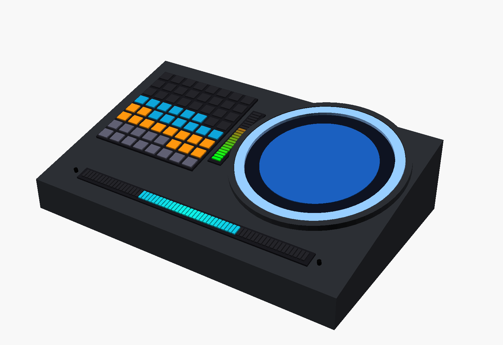
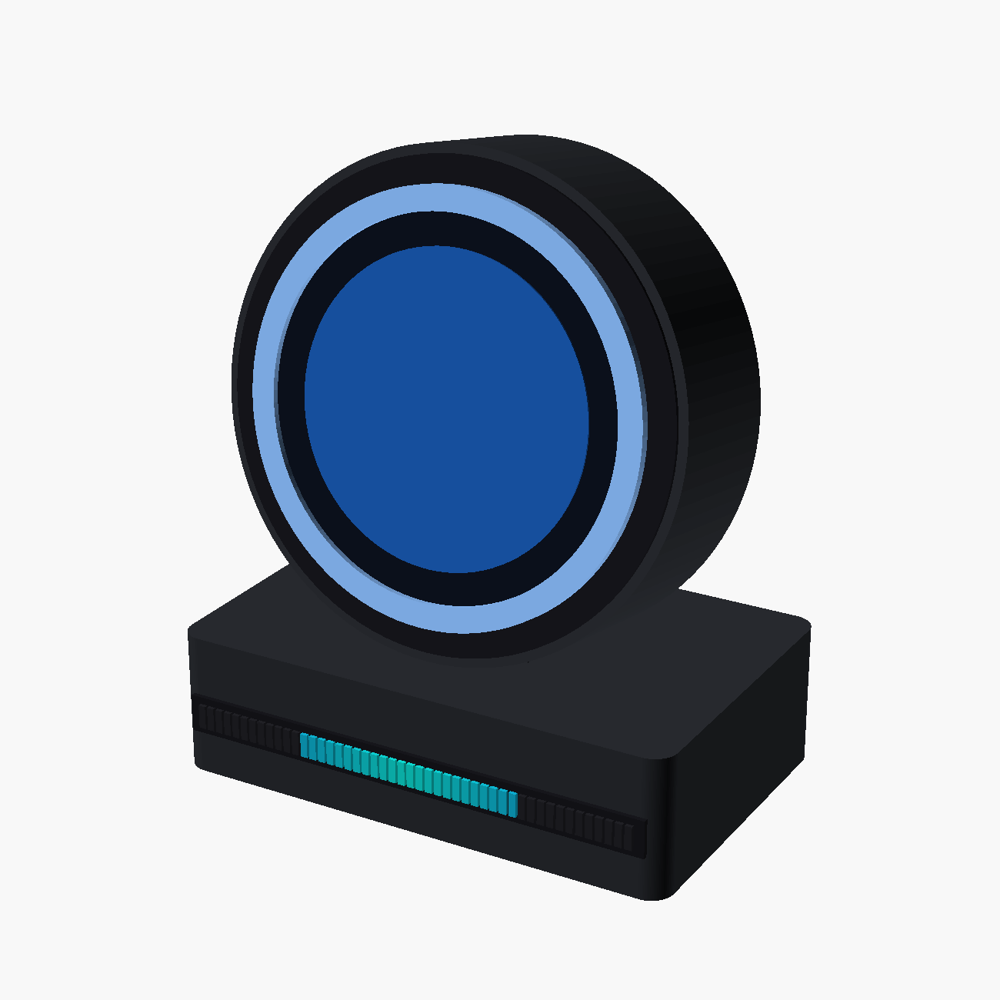
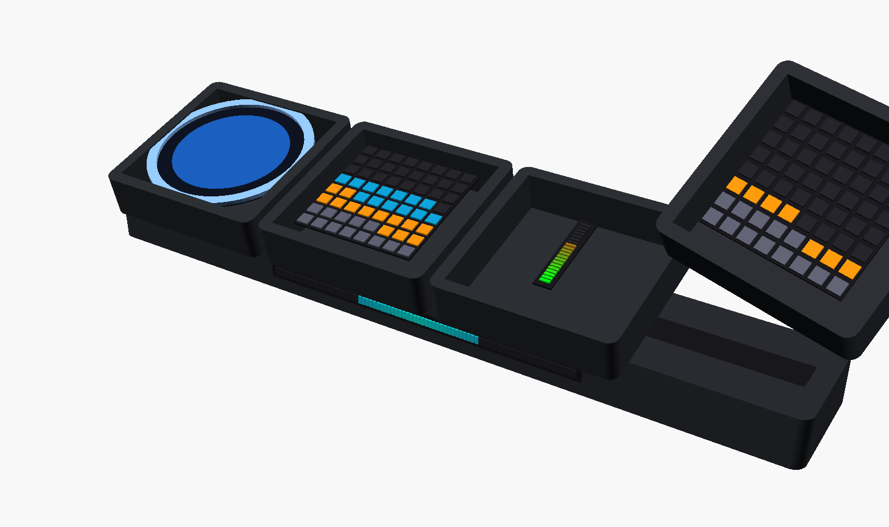
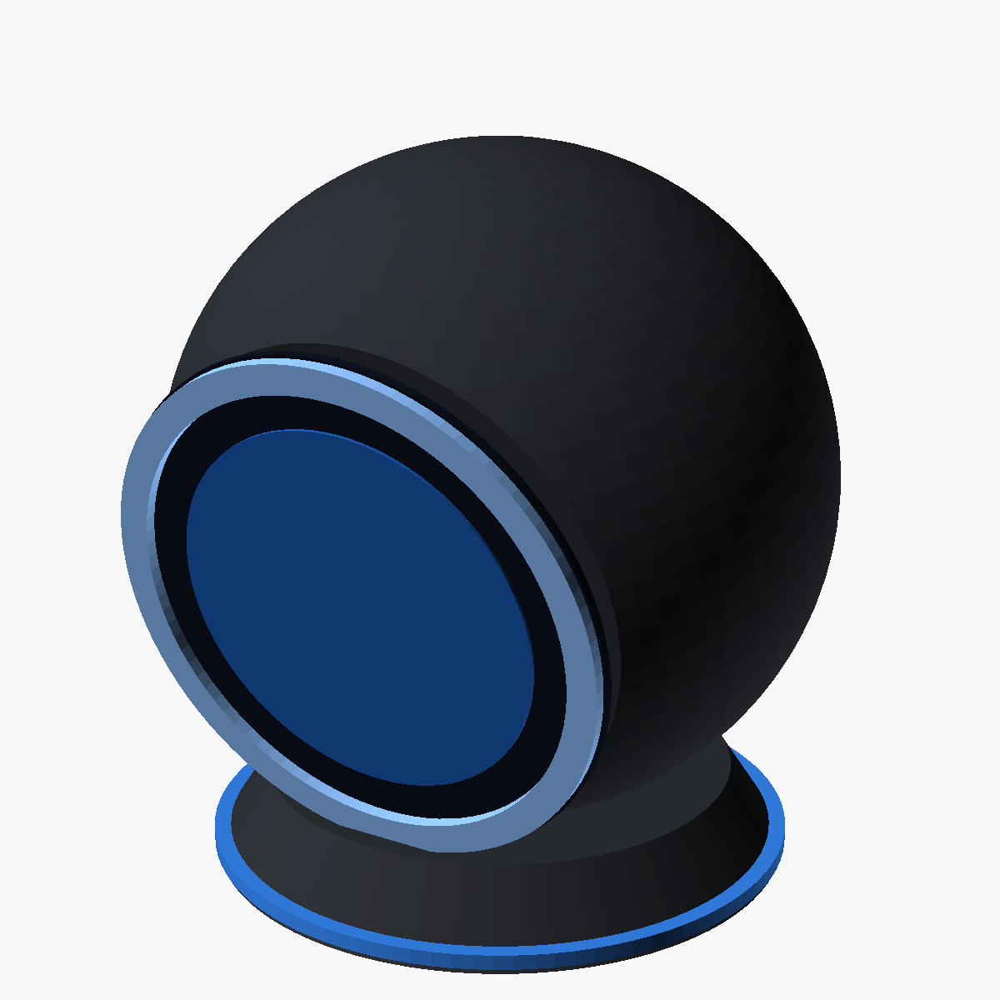
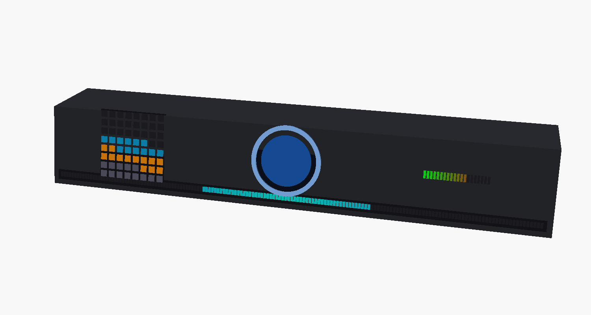

# Agent Indicator

[中文](README.md) | English

> A desk gadget that turns your LLM agent's inner life — thinking, responding,
> tool calls, usage limits and context pressure — into glanceable light and pixels.



## ✨ What it shows

| Signal | Carrier | Effect |
|---|---|---|
| Agent state | RGB Circle ×24 | thinking = purple comet · responding = green flow · tools = twin comets · waiting = blue breathing |
| Context usage | RGB Matrix 8×8 (4 tiles → 16×16) | heat map by system/tools/mcp/memory/messages |
| Usage limits | RGB Bar 20LED | session / 5h-limit dual gradient bars |
| Input/output | 480×480 round-look LCD + touch | text stream + six-page touch UI |
| Mic level | RGB Bar (up to 160LED@329mm) | center-out VU, fully on-device |
| Chimes | ES8311 + 3W PA | done / attention / error tones |
| Light effects | all strips | OpenRGB-style: solid (color picker) / breath / marquee / rainbow / off |

**Three host links**: Wi-Fi (WebSocket + mDNS discovery) / CAN (SocketCAN) / USB custom
endpoints — all listening, last-active wins. **Power**: USB-PD 15V / XT30 12-24V /
3×18650 with balancing, seamless NVDC path.

## 🖼️ Enclosure variants (6, one shared main board)

| | | |
|---|---|---|
|  |  |  |
| A "Halo" round unit | D "Tiles" magnetic modules | F "Orb" desk pet |


*E "Soundbar" under-monitor bar — plus B "Console" (recommended primary) and C "Totem"; see the ID doc*

## 📱 On-screen UI (six pages; PC-simulated = pixel-identical to firmware)

| | | |
|---|---|---|
|  |  |  |
| Home: state + I/O | Lighting | Wi-Fi |
|  |  |  |
| Devices | Files | Music |

## 🚀 Quick start

```bash
# 1. Firmware (ESP-IDF v5.2)
cd firmware && idf.py set-target esp32s3 && idf.py menuconfig   # set Wi-Fi SSID
idf.py build flash monitor

# 2. Host bridge (PC running an AP)
cd host && pip install -e . && agentind run        # forwards Claude Code state
agentind run -s demo -v                             # or demo animations first

# 3. UI simulator (optional, iterate UI without flashing)
cd tools/ui_sim && cmake -B build && cmake --build build -j && ./build/ui_sim shots/
```

## 📚 Documentation

| Doc | Contents |
|---|---|
| [01 System design](docs/en/01-system-design.md) | architecture, parts, modules, 3-link protocol |
| [02 Power design](docs/en/02-power-design.md) | PD/XT30/3S topology, charging/balancing, budget |
| [03 Industrial design](docs/en/03-industrial-design.md) | 6 variants + 3D renders + comparison |
| [04 Schematics](docs/en/04-schematic-partition.md) | 8 sheets, full pinmap, LCD 40P pinout, layout |
| [05 On-screen UI](docs/en/05-ui-design.md) | six pages + simulator usage |
| [host/README](host/README.en.md) | install, Claude Code hooks |
| [firmware/README](firmware/README.en.md) | build/flash, console commands, task stacks |

## 📂 Repository layout

```
docs/            design docs (zh) · docs/en/ English · docs/images/ renders & UI shots
hardware/3d/     OpenSCAD sources + printable STL (6 enclosures)
host/            Python bridge "agentind": sources → protocol → ws/can/usb
firmware/        ESP-IDF v5.2: 3-link comm / LED engine + fx / LVGL9 six-page UI /
                 audio cases / CAN cases / IMU view / test console (UART)
tools/ui_sim/    headless LVGL PC simulator (shares UI sources with firmware)
```

## 🗺️ Roadmap

- [x] design docs / power / protocol / firmware framework / host bridge
- [x] LVGL six-page UI + light-effect engine + PC simulator
- [ ] KiCad schematics & main board fab
- [ ] ST7701 vendor init sequence, USB vendor descriptors
- [ ] Console (variant B) enclosure print & full integration
- [ ] Tiles modular phase 2 (pogo enumeration protocol)
