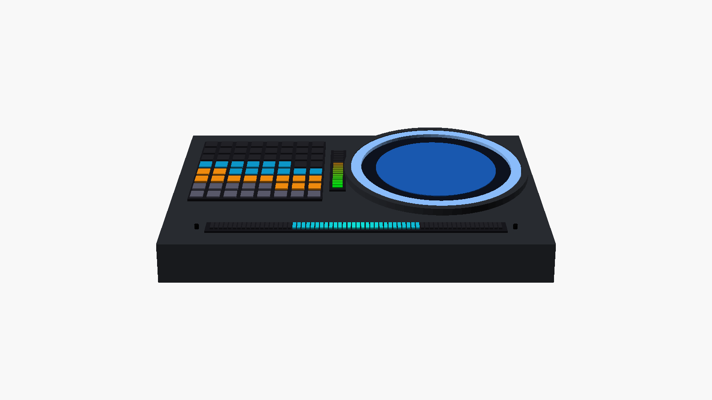

# Agent Indicator — Industrial Design (4 variants)

> Rev 0.2 · 中文版: [../03-industrial-design.md](../03-industrial-design.md)
> 3D sources & printable STL: [`hardware/3d/`](../../hardware/3d/) (OpenSCAD)
>
> Shared design language: the **Halo unit** — the LCD (70.13mm square AA) sits right
> behind the LED Circle (ID75/OD85); the ring hides the screen corners (AA diagonal
> 99.2mm > 75mm aperture). With a circular UI it reads as one "glowing round display".
> Keep a 3–4mm step between ring and panel plus a matte-black inner wall so ring light
> doesn't bleed onto the screen.

Common finish: CNC anodized aluminum or resin-printed shell, bead-blasted; 2mm milky
acrylic diffuser (~40% transmission); ≥8mm LED-to-diffuser distance with grid baffles
(8×8mm cells on the matrix to stop cross-bleed); silicone feet + ballast.

---

## Variant A "Halo" — round single unit, most compact

Halo unit + base only. Usage is drawn as arc segments along the round UI edge; context
as a ring heat map (no matrix). The "smallest cute" build; a matrix can magnet-attach
later as a variant-D tile.

| Item | Value |
|---|---|
| Head | Ø100 × 32mm (OD85 ring + 7.5mm bezel) |
| Base | 110 × 70 × 30mm, rounded |
| Mic bar | 48LED @ 99mm, front face of the base |
| Battery | 3×18650 flat in the base |
| Volume / weight est. | ~0.31L / ~420g (with cells) |

---

## Variant B "Console" — landscape one-piece, recommended primary

Full-featured. Matrix left, vertical usage bar center, Halo right, full-width mic bar
along the bottom edge, 15° wedge stance.

| Item | Value |
|---|---|
| Overall | 176 × 112 × 42mm (rear), 18mm front edge |
| Layout | Matrix left (center 40mm from left), usage bar center, Halo right (center 48mm from right) |
| Mic bar | 64LED @ 132mm, bottom center; 2 mics at the ends |
| Battery | 3×18650 across the tall rear section |
| Speaker | Ø28 downfiring chamber |
| Volume / weight est. | ~0.55L / ~580g |

16×16 upgrade path: the left zone reserves 134×134mm for a 4-tile panel
("Console XL" shell at 246mm wide, internals unchanged).

---

## Variant C "Totem" — vertical, smallest footprint

Stacked: Halo → matrix → base; usage bar on the right edge, mic bar on the base front.
Footprint only 78×62mm.

| Item | Value |
|---|---|
| Overall | 78 × 240 × 62mm (base 90mm deep for stability) |
| Mic bar | 20LED @ 41.5mm (base width limit) |
| Battery | 3×18650 upright in the base |
| Notes | Halo at eye level; IMU cuts VLED on tip-over |

---

## Variant D "Tiles" — magnetic modules, most playful

Unified **90×90×22mm** tile frame (fits the largest parts: ring OD85 / LCD 76.48).
Magnets + 4P pogo (VLED / GND / DATA-IN / DATA-OUT) on edge midpoints; dovetail into a
powered dock rail. Four matrix tiles in 2×2 give native 16×16.

| Item | Value |
|---|---|
| Tile | 90 × 90 × 22mm, ~0.8kg magnetic retention (Ø8×3 N magnets ×4) |
| Dock | 370 × 60 × 26mm (4 slots), or 190mm 2-slot |
| Mic bar | 80LED @ 164.7mm in the dock front edge (48LED@99mm for the short rail) |
| Electrical | VLED bus in the rail + WS2812 data daisy-chained through pogo across tiles; per-tile EEPROM (24C02) type ID, enumerated at boot |
| 16×16 | 4 matrix tiles snap 2×2 off-rail, edge pogos S-route the data, the block then takes 1 rail slot |

---

## Variant E "Soundbar" — under-monitor bar

Slides into the gap under a monitor stand; the 12°-tilted front face puts everything
toward the user: 8×8 matrix left (compact 48mm pitch), a shrunken Halo center
(Ø47 ring + a 1.28" round LCD such as GC9A01), horizontal usage bar right, and a
full-width **160LED@329mm mic bar** along the bottom edge.

| Item | Value |
|---|---|
| Overall | 340 × 58 × 54mm, front tilted 12° |
| Mic bar | 160LED @ 329mm (longest in the line, best VU) |
| Display | central Halo uses a 1.28" round LCD, ring shrinks to Ø47 |
| Battery | 2×18650 (height-limited), or battery-less USB-PD |
| Notes | mics at both ends, away from monitor speakers |

## Variant F "Orb" — spherical desk pet

A Ø110 sphere with a flattened front carrying the Halo, ambient ring glowing at the
base, gazing up 12° at the user. Status + I/O only (no matrix/usage — they live in
the round UI). The most affective, lowest-part-count form; the base ring reuses the
Circle LED board.

| Item | Value |
|---|---|
| Overall | Ø110 sphere + Ø96 weighted base, ~135mm tall |
| LEDs | front Circle 24 + base ambient ring (two Circle boards) |
| Battery | 1×18650 centered as ballast, or 21700 |
| Notes | IMU tap = confirm gesture; two CNC/printed hemispheres bonded at the equator |

## Comparison & Recommendation

| | A Halo | B Console | C Totem | D Tiles | E Soundbar | F Orb |
|---|---|---|---|---|---|---|
| Feature completeness | ◐ (no matrix) | ● | ● | ●+ | ● | ◔ (status+IO only) |
| Compact / refined | ●● | ● | ● (smallest footprint) | ◐ (long rail) | ● (hides under monitor) | ●● (desk pet) |
| Mechanical difficulty | low | medium | medium | high (pogo/magnets/enum) | medium | medium (sphere seam) |
| 16×16 path | external | new shell | n/a | native | n/a | n/a |
| Positioning | entry / gift | **primary, build first** | derivative | flagship, phase 2 | always-on workstation | affective derivative |

**Suggested route**: build B (Console) first to validate all circuits and firmware →
reuse the Halo unit for A → phase 2 for D's dock and tiles. All four share one main
board (doc 04); only shells and LED carriers differ.

Dimensions assumed (correct with real parts in hand):
1. 18650 length 65mm (unprotected), holder envelope 58×78mm;
2. matrix board: PCB 1.6mm + LED 2.5mm;
3. ~~LCD module total thickness 3.5mm (with CTP)~~ confirmed: **2.34mm** (73.03×76.48×2.34 actual spec).
