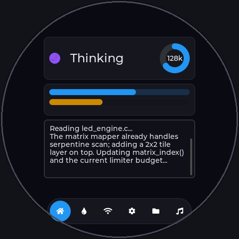
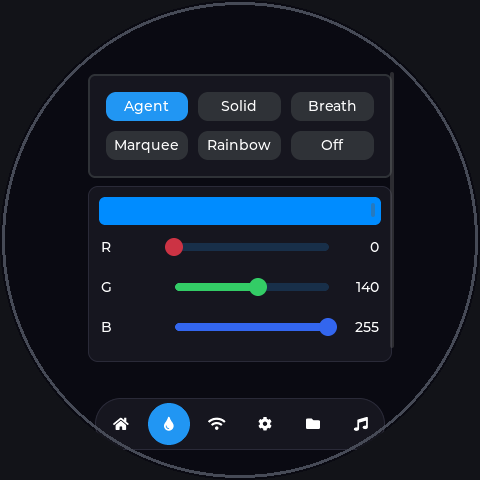
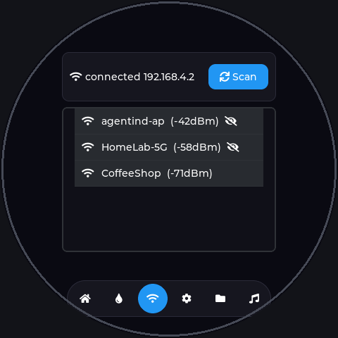
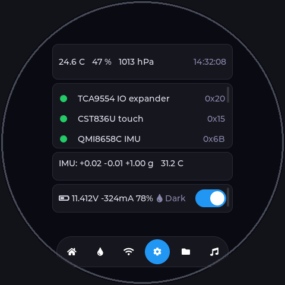
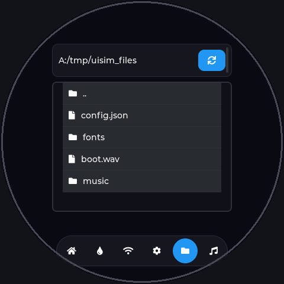
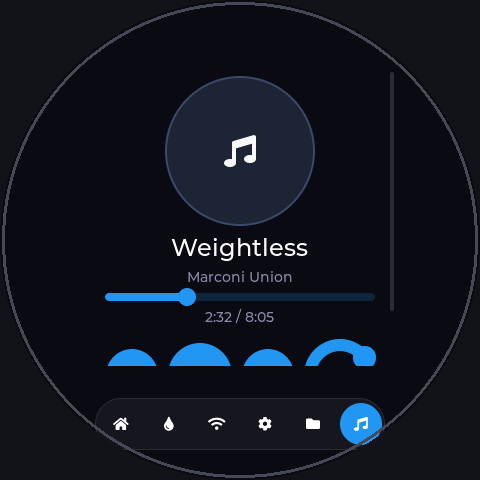
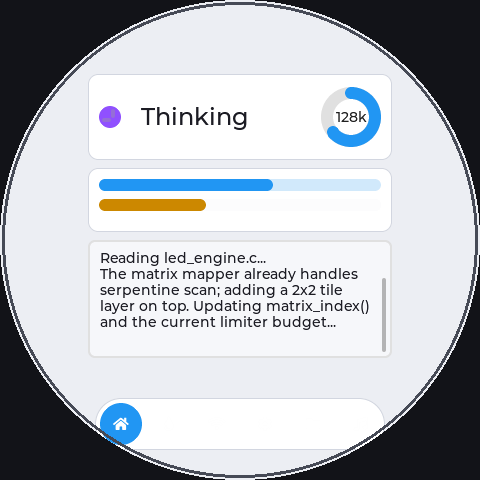
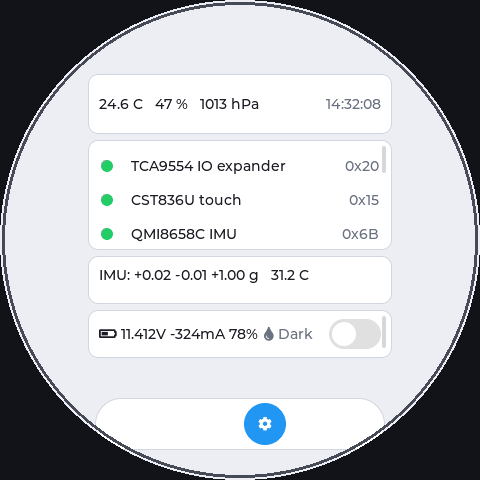

# Agent Indicator — On-screen UI Design

> Rev 0.1 · 中文版: [../05-ui-design.md](../05-ui-design.md)
> Screenshots are produced by `tools/ui_sim` (headless LVGL on PC) and are
> pixel-identical to the firmware rendering — both compile the same sources
> in `firmware/main/ui/screens/`.

**⚠ Round-screen layout**: the LCD is a **480×480 circular** active area (the inscribed
circle; corners are invisible), so the UI **does not use lv_tabview** (its full-width tab
bar and edge-hugging card corners would be clipped). Instead:

- content is confined to a **centered safe area** (320×300, inside the R240 circle), with a
  66px margin at the top;
- navigation is a **bottom-centered pill** (290 wide, within the bottom chord), 6 icons;
- screenshots are masked to a circle to show the real visible area (outside = bezel).

All data-update entry points (`ui_*_set`) are internally locked and callable from any
task; Light/Dark themes are supported (§7).

## 1. Home — status & I/O stream



- Top bar: state color dot + state name (follows i18n language) + context arc (`128k`);
- Two usage bars: session (blue) / 5h limit (orange), fed by USAGE messages;
- Below: the LLM input/output text stream (TEXT messages, 4KB scrollback).

## 2. Lighting — LED effects (OpenRGB-style presets)



- Modes: **Agent** (default state-driven) / **Solid** / **Breath** /
  **Marquee** / **Rainbow** / **Off**;
- RGB sliders + live preview swatch; Speed (1-100) and global brightness;
- Equivalent controls: console `light <mode> [RRGGBB] [speed]`, protocol CONFIG key=4/5;
- Override effects treat matrix+circle+bars as one logical strip; the current
  limiter still applies.

## 3. Wi-Fi — connection management



- Status row (connected IP / disconnected) + Scan button (async esp_wifi scan);
- Network list (RSSI + lock mark); tapping pops a full-screen password keyboard,
  then `esp_wifi_set_config` persists to NVS and reconnects.

## 4. Devices — sensor & peripheral detection (= settings page)



Four zones, top to bottom:

1. **Environment card**: temperature ℃ / humidity % / pressure hPa (SHT4x + BMP280) + RTC clock, 500ms refresh;
2. **Presence table** (scrollable, 11 rows): green = present / red = missing, right column shows I2C address or status. Probed once at boot via `sensors_init` + `i2c_probe`:

   | Device | Addr | Note |
   |---|---|---|
   | TCA9554 IO expander | 0x20 | slow-control expander |
   | CST836U touch | 0x15 | cap touch |
   | QMI8658C IMU | 0x6B | 6-axis |
   | ES8311 codec | I2S | audio |
   | INA226 monitor | 0x40 | power telemetry |
   | MP2760 charger | 0x5C | charging |
   | microSD | — | SDMMC mount state |
   | CAN bus | 500k | TWAI |
   | **SHT4x temp/humi** | **0x44** | **temp/humidity sensor** |
   | **BMP280 pressure** | **0x76** | **barometer (SDO=GND; 0x77=SDO=VDD)** |
   | **PCF8563 RTC** | **0x51** | **I2C real-time clock** |

3. **Live IMU row**: 6-axis accel + temperature, 500ms refresh;
4. **Power row + theme switch**: V/I/SoC, with a Light/Dark switch on the right (see §7).

The three new I2C environment drivers live in `firmware/main/drivers/sensors.cpp`: SHT4x
(0xFD high-precision), BMP280 (calibration + Bosch fixed-point compensation), PCF8563
(BCD time registers). When absent each `*_present()` returns false and the row shows red.
They share the I2C bus (plug into the Qwiic connector).

## 5. Files — file browser



- Backed by LVGL FS (drive `A:` = POSIX VFS); browses `/spiffs` and `/sdcard`;
- Tap to enter directories, `..` to go up, circular-scrolling path bar.

## 6. Music — player



- Track info + progress + transport (prev/play/next) + volume arc (ES8311 DAC);
- Backend is `audio_player` (WAV from SD); playlist glue marked TODO.

## 7. Light / Dark theme

The whole UI supports light/dark themes, toggled by the switch at the bottom-right of
the Devices page and **persisted in NVS**. Implementation: `screens.c` keeps two palette
token sets (`t_bg/t_card/t_text/t_sub/t_area`); switching re-runs `lv_theme_default_init`
(built-in widgets) + rebuilds the UI from tokens, then calls the `on_rebuild` host
callback to re-populate data. Can also be driven by protocol/console.

| Dark (default) | Light |
|---|---|
|  |  |
|  |  |

## Simulator usage

```bash
cd tools/ui_sim
cmake -B build && cmake --build build -j   # reuses LVGL from firmware managed_components
./build/ui_sim shots/                      # writes ui-*.bmp (dark) + ui-light-*.bmp (light), 12 total
```

Note: LVGL must use CLIB malloc (`CONFIG_LV_USE_CLIB_MALLOC` in firmware,
`LV_USE_STDLIB_MALLOC=LV_STDLIB_CLIB` in the simulator) — the built-in 64KB
TLSF pool can't hold six pages of widgets and OOM ends in an infinite loop
inside `lv_obj_add_style`.
